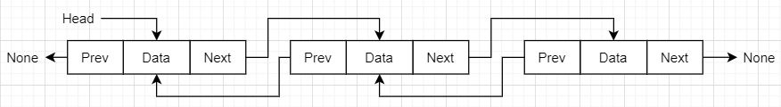

# Python基础知识

## 数组

### 定义

    >>> array = [9, 8, 7, 6, 5, 4, 3, 2, 1, 0]
    >>> print(array[5])
    4
    >>> for item in array:
    ...     print(item, end=' ')
    ...
    9 8 7 6 5 4 3 2 1 0 
    >>> 
    >>> for (index, item) in enumerate(array):
    ...     print(index, item)
    ...
    0 9
    1 8
    2 7
    3 6
    4 5
    5 4
    6 3
    7 2
    8 1
    9 0

### 复杂的操作
嵌套的数组，在读取时，一定要正确方式获取。以二维为例：

    >>> complex_array=[(1,2), (3,4), (5,6)]
    >>> for n, (x,y) in enumerate(complex_array):
    ...     print(n, x, y)
    ...
    0 1 2
    1 3 4
    2 5 6
    >>> for n, x, y in enumerate(complex_array):
    ...     print(n, x, y)
    ...
    Traceback (most recent call last):
      File "<stdin>", line 1, in <module>
    ValueError: not enough values to unpack (expected 3, got 2)
    >>>
    >>>
    >>> array0 = [0 for _ in range(5)]
    >>> print(array0)
    [0, 0, 0, 0, 0]
    >>>
    >>>
    >>> auto_array0 = [[0 for _ in range(4)] for _ in range(3)]
    >>> print(auto_array0)
    [[0, 0, 0, 0], [0, 0, 0, 0], [0, 0, 0, 0]]
    >>>
    >>>

### 示例
* 队列：先入先出
* 栈：先入后出

#### 队列的实现

    class Queue:
        def __init__(self):
            self.list = []
            return
    
        def enqueue(self, item):
            self.list.append(item)
            return
    
        def dequeue(self):
            self.list.pop(0)
            return
    
        def is_empty(self):
            return self.list == []
    
        def size(self):
            return len(self.list)
    
        def display(self):
            print("Queue:", end=' ')
            for i in self.list:
                print(i, end=" ")
            print()
    
    
    if __name__ == '__main__':
        queue = Queue()
        for i in range(10):
            queue.enqueue(i)
    
        queue.display()
        print(queue.size())
        print(queue.is_empty())
        queue.dequeue()
        queue.display()

    输出：
        Queue: 0 1 2 3 4 5 6 7 8 9 
        10
        False
        Queue: 1 2 3 4 5 6 7 8 9 
#### 栈的实现

    class Stack:
        def __init__(self):
            self.data = []
            return
    
        def __len__(self):
            return len(self.data)
    
        def is_empty(self):
            return self.data == []
    
        def push(self, item):
            self.data.append(item)
            return
    
        def get_top(self):
            if self.is_empty():
                return "stack is empty"
            return self.data[-1]
    
        def pop(self):
            if self.is_empty():
                return "stack is empty"
            return self.data.pop()
    
        def display(self):
            print("Stack:", end=" ")
            for i in self.data:
                print(i, end=" ")
            print()
    
    
    if __name__ == '__main__':
        stack = Stack()
        for i in range(10):
            stack.push(i)
    
        stack.display()
        print(stack.get_top())
        print(stack.pop())
        stack.display()
    
    输出：
        Stack: 0 1 2 3 4 5 6 7 8 9 
        9
        9
        Stack: 0 1 2 3 4 5 6 7 8 

## 链表

### 链表信息

1. 链表节点：每个节点分成两部分，也即：数据域、指针域
2. 头结点：指向链表的第一个节点
3. 尾结点：指向链表的最后一个节点
4. None：链表最后一个节点的指针域为空

### 链表类型

* 单向链表

* 双向链表

### 示例
* 队列的特点：先入先出
* 栈的特点：先入后出

#### 队列

#### 栈

## 栈

## 树

## 图

2020/9/5