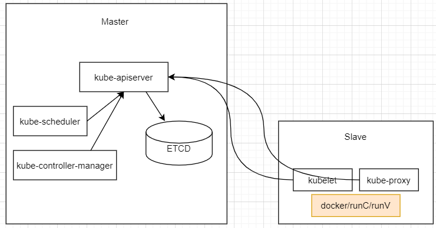

# ReadMe

`Kubernetes`，简称 `K8S`，这是因为 `ubernete` 总共 8 个字母，所以简称 `K8S` .

`K8S` 是一款从谷歌 `Borg` 系统的架构逐步衍生的开源的容器管理平台系统。

如上图所示，K8S主要包括：
* 控制面管理节点：
    * Kube-Apiserver: 系统的API聚合点，所有的组件都是通过该点进行信息互通的；
    * Kube-Scheduler: 系统的默认调度器，用以容器应用部署的资源调度，支持按照CPU、内存、GPU、CRD等资源的调用，也支持按照亲和性/非亲和性调度；
    * Kube-Controller-Manager: 系统控制器，包括：副本控制器、服务控制器、节点控制器、部署控制器、Endpoint控制器等；
    * ETCD：可靠的分布式KV数据存储，用以存储集群配置数据和运行数据。
* 数据面工作节点：
    * Docker/runC/runV: 容器的runtime系统，当前比较流行的有docker(社区版)、kata(基于runV的安全容器)、Containerd、runC、runV、rkt(逐步退出市场)等；
    * kubelet：工作节点的Agent，订阅Kube-Apiserver某些信息，负责调度到该节点上的`pod`、容器镜像、容器、容器网络(host/cni)、容器存储(`pv
    /volume`)等信息的生命周期管理；
    * kube-proxy：工作节点上负责处理`service`对应规则(iptables/ipvs)创建、更新、删除等生命周期管理；

为了支持多种不同场景，K8S定义了一些基本对象：
* Deployment：无状态应用部署，应用自身不缓存任何需要持久化信息（若需要，可通过API从有状态应用中读取），如 web-frontend；
* StatefulSet：有状态应用，应用需要缓存需要持久化的信息，比如：配置中心、数据缓存、数据库等；
* DaemonSet：守护进程应用，这类应用类似Agent应用，随着符合条件的工作节点的扩缩容而增加、减少实例数量，且每个工作节点上只部署一个实例；
* Job：短任务应用，这类应用的生命周期是有限的，也即：在 `pod` 中业务容器处理结束后，短任务控制器将根据其状态控制实例数量；无状态、有状态、守护进程应用都属于 `Loang Run` 的应用；
* Cronjob：定时任务，与Linux环境中的crontab类似，定时、周期性完成业务容器的功能；
* Configmap：简易的配置中心，支持准实时配置刷新，业务容器可自行感知配置变化，而更新配置数据；
* Secrets：简易的密钥配置中心，配置数据是加密状态的，支持准实时配置刷新；
……
……

后面我们将逐一的学习和了解K8S组件、对象、功能的实现。

2020/8/23