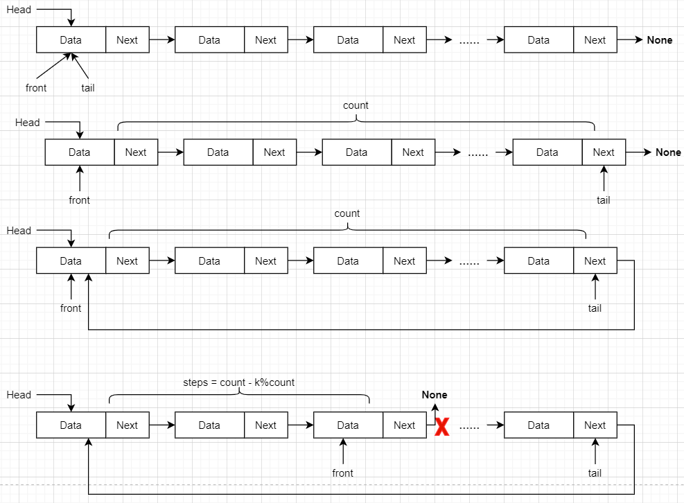

# 旋转链表

## 题目

给定一个链表，旋转链表，将链表每个节点向右移动 k 个位置，其中 k 是非负数。

## 示例

### 示例 1:

    输入: 1->2->3->4->5->NULL, k = 2
    输出: 4->5->1->2->3->NULL
    解释:
    向右旋转 1 步: 5->1->2->3->4->NULL
    向右旋转 2 步: 4->5->1->2->3->NULL

### 示例 2:

    输入: 0->1->2->NULL, k = 4
    输出: 2->0->1->NULL
    解释:
    向右旋转 1 步: 2->0->1->NULL
    向右旋转 2 步: 1->2->0->NULL
    向右旋转 3 步: 0->1->2->NULL
    向右旋转 4 步: 2->0->1->NULL

### Node结构定义

#### Golang

    type ListNode struct {
        Val int
        Next *ListNode
    }

#### Python

    class ListNode:
        def __init__(self, x):
            self.val = x
            self.next = None

## 解题思路

### 图示

### Go代码

    func rotateRight(head *ListNode, k int) *ListNode {
        if head == nil || k == 0 {
            return head
        }
        
        front, tail := head, head
        count := 1
        for tail.Next != nil {
            tail = tail.Next
            count++
        }
        
        steps := count - k%count
        tail.Next = head
        for steps > 1 {
            steps--
            front = front.Next
        }
        
        head = front.Next
        front.Next = nil
        return head
    }

### Python代码

    class Solution:
        def rotateRight(self, head: ListNode, k: int) -> ListNode:
            if not head or not head.next or k == 0:
                return head
    
            front, tail = head, head
            count = 1
            while tail.next != None:
                count = count + 1
                tail = tail.next
    
            steps = count - k % count
            print(count, steps)
            tail.next = head
    
            while steps > 1:
                steps = steps - 1
                front = front.next
    
            head = front.next
            front.next = None
            return head

2020/9/16